# TestPointCloud
A site for hosting a point cloud visualisation.


A workflow for the successful scan of a cave or mine using the ZEB horizon scanner


## What this document will detail

Using the recipe detailed in the following document, you will be able to generate a successful scan of a cave or mine.

- elementary principles of the survey approach will be detailed, from standard cave surveying techniques to strategies for dealing with complex caves.
- this recipe book will also detail the use of the different cloud manipulation softwares that are needed to export the field data to publication quality figures. 
- this tutorial also makes use of an example dataset, from start to finish. 

## Introduction to elementary cave survey techniques

### Traditional cave survey techniques
In this tutorial, *traditional cave survey* refers to data gathered by measuring the distance, inclination and azimuth from one point in 3D space to the next. 
Such data is usually collected by using a laser distance-metre with magnetic sensors e.g., DistoX, BRIC4 and others.
Data can then be compiled into 3D files using dedicated software, such as *Therion* or *Survex* \*

The main point of such software is to transform the collected field data into a connected network or __centreline__, where each node or __station__ is a point in 3D space with specific metadata (on top of the usual X, Y and Z coordinates $\dagger$ ). Some __stations__ are named, and provide useful reference points to tying in additional survey data. Other __stations__ are anonymous, referred to as __help lines__, they are shots taken with the disto from named stations with the intent of helping the survey team draw the cave passage outline accurately.

Exporting and georeferencing a __centreline__ with its __help lines__ is the first step to drawing the cave map which is fleshed out around it. 

\* All links to relevant download pages of the software are given in the section: [Software Prerequisites]().

$\dagger$ A more detailed insight into the treatment of cave survey data is given in [From centrelines to point clouds]().

### Scanning the cave
In this tutorial, a *scan* refers to a self-contained file generated by progressing through the cave while holding the ZEB scanner in one's hand.
While some small caves can be completely surveyed using a single *scan*, many require several or more scans to be taken and later assembled together into a full cave survey.

Reasons for splitting the cave survey in several scans include:
- too long passages which would result in an extremely large file size, unable to be processed using the field computer.
- too narrow or too constricted passages, which would result in the scan processing failing, thus necessitating a scan to be taken on either side of the narrow passage.

A scan is usually processed using proprietary software on a field laptop at the end of the work day. After processing, visual checks are required to make sure that the geoSLAM algorithm performed as expected and produced a reliable _point cloud_.  

_Point clouds_ are the essential product of a survey carried out with the ZEB scanner. With points numbering in the millions to hundreds of millions, these are large data files which are subsequently manipulated — scaled, translated, rotated in 3D space — using appropriate software e.g., CloudCompare.

Transforming and merging together different point clouds of a single survey  can be done in two ways. 
1. The first option is to rely on a > 20 % overlap between scans, which is achievable in long, interconnected caves where no single part of the cave is separated from the whole by any constriction
2. The second, more time consuming option is to survey the cave using traditional cave survey techniques, to reference the survey stations during scanning and use these control points to generate a transformation matrix to be used on a point cloud. In this way, even disconnected members of a cave survey can be brought into their respective geographical positions, and their geometric relationships can subsequently be explored.

In this guide, the second method will be explained in detail as it is likely the one to be used for most natural caves. 


## Setting up the Workspace for Therion

### Download Therion

When asked where to save the files, select your `Documents` folder. This is important, as you will need to set up your environment variables to recognise `therion` as a command.

### Update environment variables

On Windows 10, type `environment variables` in your search bar. Select the `Edit environment variables` option.

 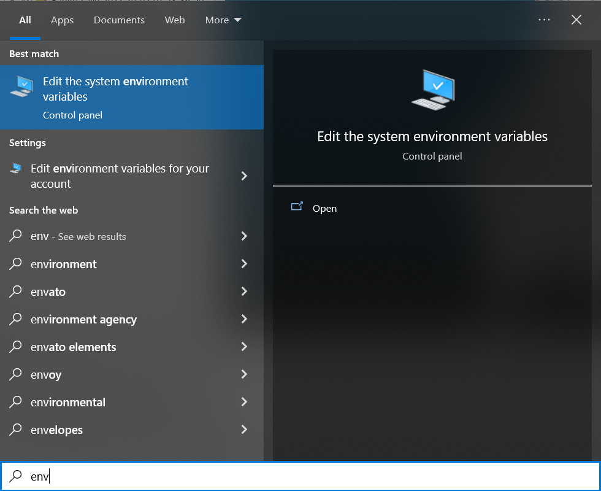 


Select the update environment variables window and choose `User environment variables`. You will find a table with some variables already defined. Select `Path` and click `Edit`

 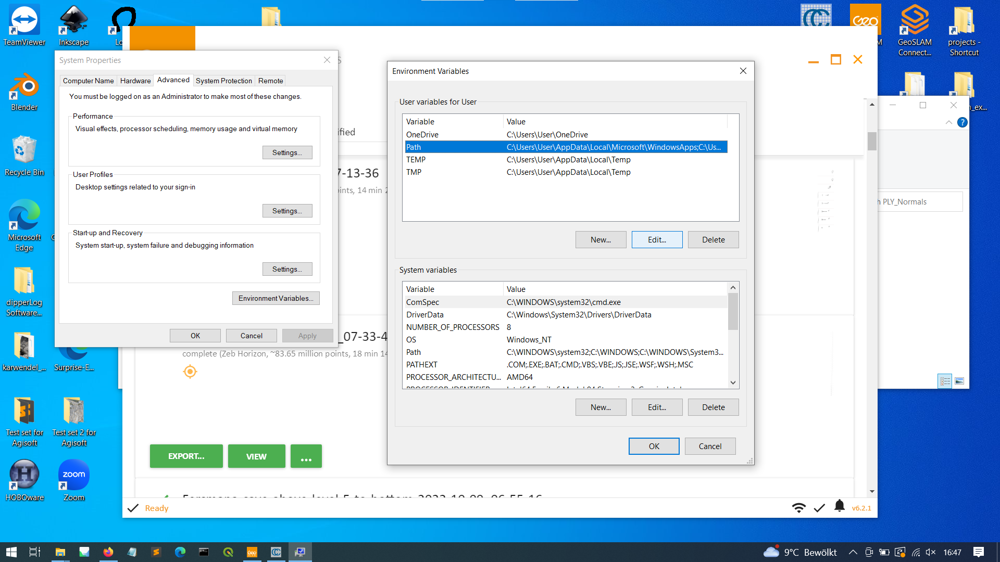 


On a blank line, enter the path to the Therion executable. In this case it will be: 

```
C:Users\<YourUserName>\Documents\Therion
```

Close all windows by pressing successive `ok` buttons.

 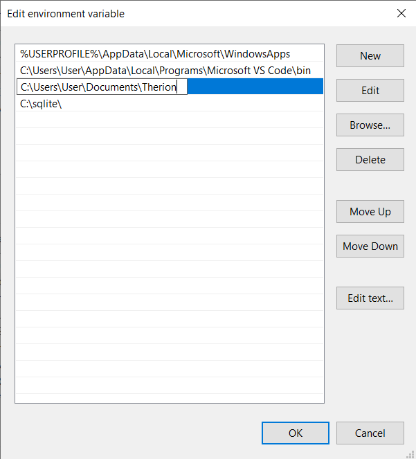 

You can now check that therion is on the PATH by opening your command prompt, and entering the command `therion`. 
If all is set up correctly, then the first line of the log should indicate the version of therion installed on the machine. At the end of the message, an error should indicate that no source files were specified. 

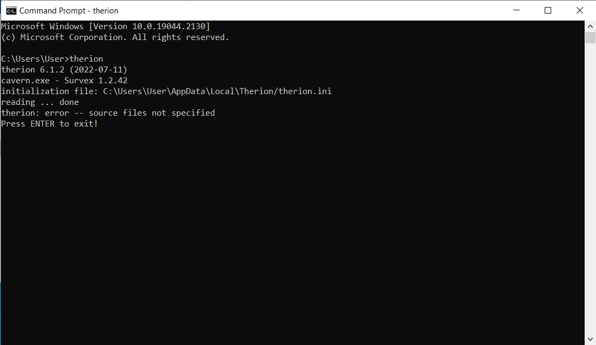 

If the installation was unsuccessful, you will see the following error message:  

```
command not found : therion
```

Double check that the path to the therion executable (therion.exe) is correct and does not contain any spaces. Close the terminal and retry.

### Installing VSCode and its Therion extension

Download VScode, leaving all default install options. Open the application and look for the extensions panel on the top left of the screen (this looks like four squares, with the north-east one flying away).
In the search bar, look for Therion and install the therion language support extension developed by Rhys Tyers. 
It provides syntax highlighting and compilation capabilities for any file written in a therion format. 

 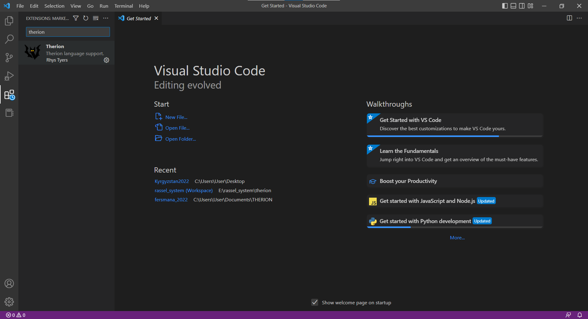 


## From centrelines to point clouds

The goal of this section is to explain how to go from cave generated data to a table containing reference points with X,Y,Z coordinates to be used for the georeferencing of a point cloud.

### Cave data

####  Data collection

The first step is to collect survey data in the field using the traditional techniques. Whatever the instruments used, a table of measurements will look like this:

|from station|to station|length|azimuth|inclination|
|---|---|---|---|---|
A|B|2.00|334|10|
B|C|1.50|24|23|
|C|...|...|...|...|

Converting to _Therion_ format is trivial. Simply opening a new file in one's text editor of choice, one defines a survey, and within, a centreline.
In the following code blocks, anything between `<` and `>` are  names you can replace with the appropriate entries.  

####  Creating a workspace folder

First of all, create a new folder or directory called `CaveSurveyData` and within a subfolder called for each respective site, named 
`<CaveName>`.

####  Creating a therion data file

The therion data file (a text file saved asc) should look somewhat like this.
```
survey <CaveName> -title <Title>

    centreline
    units length metres
    units compass clino degrees
    data normal from to tape compass clino
    A   B   2.00    334 10  
    B   C   1.50    24  23
    C  ... ... ... ... 
    <DATA>
    endcentreline
endsurvey
```

####  Georeferencing the survey 

In the  `<CaveName>.th` file, you can add geographic coordinates to any station, such as possibly the starting, outside station of your survey. Do this by adding a coordinate system specification and the coordinates of the starting station. You may specify the coordinates of one or more of the stations if you have taken GPS positions of several entrances. Therion does the heavy lifting of calculating the errors between the survey centreline and the fixed stations.

```
survey <CaveName> -title <Title>

    centreline
    
    cs <COORDINATE-SYSTEM>  # this can be any c. system referenced by its epsg code
                        # e.g., lat-long: epsg:4326
    fix A <X> <Y> <Z>

    units length metres
    units compass clino degrees
    data normal from to tape compass clino
    A   B   2.00    334 10  
    B   C   1.50    24  23
    C  ... ... ... ... 
    <DATA>
    endcentreline
endsurvey
```

### Exporting the cave data to a table

####  Creating a therion configuration file

You should now create a new file called therion configuration file called `config.thconfig`. 
This enables the therion program to read a file therion data format and compile the data to many output formats (from 2D maps to 3D models, to queryable databases).

Opening `config.thconfig` in a text editor, one writes the recipe:

```
source <CaveNameCave>.th   # anything after a hashtag is a comment

cs <OUTPUT COORDINATE SYSTEM>
export database <CaveNameCave>.sql
```

####  Compiling the file with Xtherion

1. Windows $\rightarrow$   You can now double-click on the `config.thconfig` file and click on the cogwheel or F9
2. Visual StudioCode recipe $\rightarrow$  right-click on the `config.thconfig` file and click `Compile in Therion`

Now you should see a new document appear in your workspace, called `<CaveName>.sql`, an output of the Therion compilation. 

####  Querying the database 

It is now necessary to convert the `<CaveName>.sql` into a proper database, a collection of pivot tables which can be queried e.g., `<CaveName>.db`. 

To do this, open your command prompt (or terminal) and run:

```
cd <Path\To\Workspace> # Windows, navigating to workspace
cd <Path/To/Workspace> # linux or Mac, navigating to workspace
```

Then: 
```
sqlite3
```

This opens a sqlite3 environment in which we should read a .sql file. This is done by running the command:  

```
.read <CaveName>.sql
```

You should then set up the output mode and output path of the query you are about to make on the database.
In succession, paste these commands (up to, not including the # character) and press ENTER.
```
.header on # this will display column names in the table
```
```
.mode tab  # this sets up the output format to be tab-delimited
```
```
.output <CaveName>_StationsQuery.tab # this sets the path to the output file
```

You can then copy/paste the code below: 

```
SELECT s.NAME,s.X,s.Y,s.Z from STATION as s
WHERE  (s.NAME != "-") AND (s.NAME != ".");
```

_This is a query in SQL syntax, specifically asking to select the name, and the X,Y and Z coordinates of each entry in the STATION table from the database. It also filters out any anonymous station (whose name would be '.' or '-')._


and finally you may quit the sqlite3 console by entering: 

```
.quit
```

 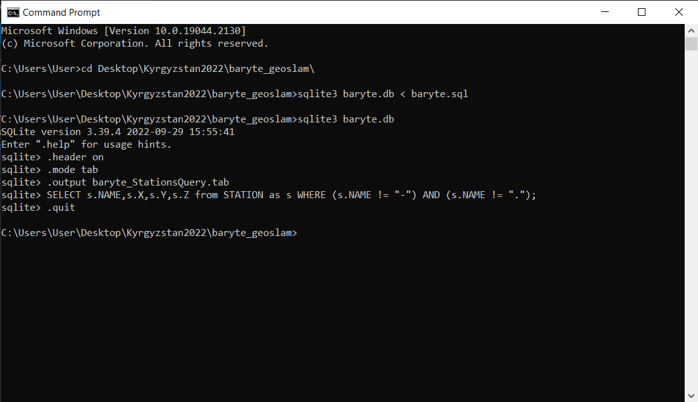 


**Perfect! You should now have a file named `<CaveName>_StationsQuery.tab` which will be crucial for georeferencing the point clouds** 

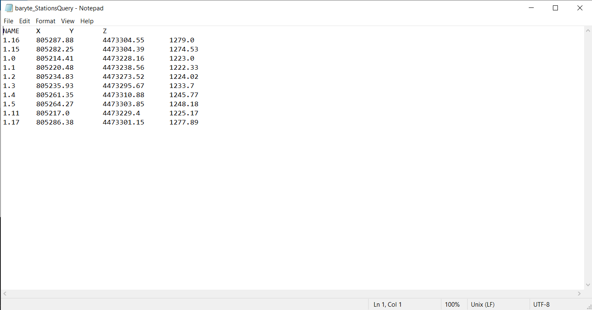 


## Some considerations while scanning with ZEB in the field


### If you can, scan in a big loop

Set up a starting position for your scanner and place distinctive rocks or items that mark the specific starting orientation of the scanner. In practice, we found that making a negative wedge with two small rocks (hugging the pointy end of the scanner handle) is a good way to remember in which orientation the scan was started. 

Scout the locations of the stabilised survey stations. You need to hold the cross-shaped hole at the base of the handle to such stations without moving for about 9 rotations of the scanner head for the scan to register this position as a reference point. You need a minimum of three stable stations for each scan for the _absolute georeferencing_.

If you can, incorporate even smaller loops in your trajectory within the cave passage you are exploring. 


### How many scans do you need?

Depending on the complexity of the cave you are about to survey, it is likely you will need to split your cave survey into different scans. 
Think about where exactly to split the scans as you will need to turn around before narrow ends or any squeezes. In steeply inclined passages, it may not be possible to complete a full loop with the scanner.


In this section, you will learn how to use the raw data output by the ZEBHorizon datalogger and produce a geo-referenced point cloud.

## Downloading the raw data off the datalogger

After having finished a scan with the ZEB horizon scanner, connect a USB-stick or any data storage device to the datalogger and wait until the LED indicators stop flashing (indicating data transfer in progress).

Connect the data storage device to your field laptop and navigate to your workspace. Create a `GeoslamRaw` folder and copy/paste the data from the USB stick there. 
If you are working on several sites, you may subdivide this directory into appropriately named respective caves.
While in the field, number the different scans to be done. The easiest is to give a simple name to each scan before you start scanning the object of interest and keep the notes to help with processing on the computer. 

Create another folder called `GeoslamProcessed` where various outputs from the geoslam processing will be stored later. 

## The HUB workflow

### Opening the geoSLAM processing software

After installing GeoslamHUB and activating the license, you should be able to open the program. If this is the first time you open HUB on your machine, there won't be any datasets yet.

If not, you will see a list of datasets and their processing status. Should you have already processed some datasets in a project, it is possible to change the "home" folder name in the configuration section. 

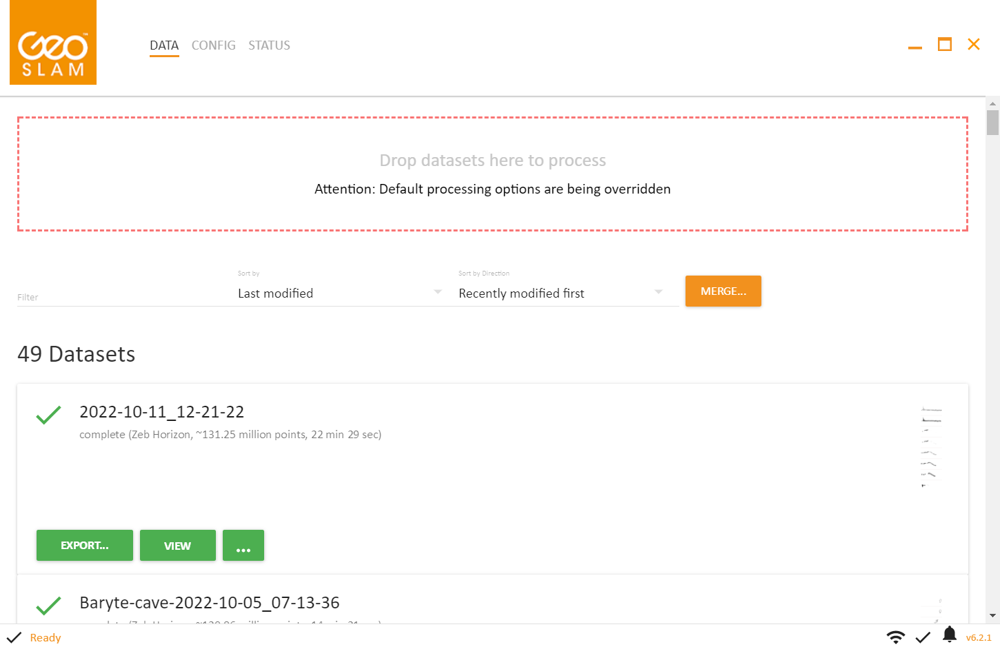 


### Adding raw files to be processed

To add a dataset for processing, simply open your file explorer and select one of the raw geoslam files from the `GeoslamRaw`folder. Alternatively, click the `Drop datasets here to process` option (it will turn orange). 

Your geoslam filename will look something like this:

`<Year>-<Month>-<Day>_<Hours>-<Minutes>-<Seconds>.geoslam`

Open it.

The home screen will update with the new number of datasets. You will see a green status bar underneath the entry from your newly imported file. If you import several files at once, you will see that some are queued for SLAM processing, while others are already being processed for Local Slam algorithm. This part takes a little time, from about 15 minutes to several hours for large files. Of course, this depends on your machine. 

Once the file is ready, you will see a green tick next to the file name and the status bar will be inactive. Three green buttons will be visible under the scan's name.


Before proceeding any further, it is helpful to rename the processed scan with a human-readable name. You could for instance keep the datetime information, should you have to duplicate this scan at any point during your project. 

To do this, click on the three dots and navigate to `Rename`. 

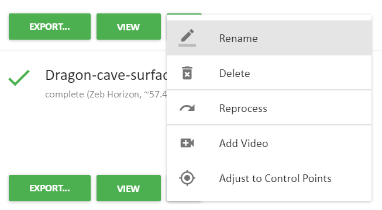

The filename should look somewhat similar to: 

`<CustomScanName>-<Year>-<Month>-<Day>_<Hours>-<Minutes>-<Seconds>`

<!--- 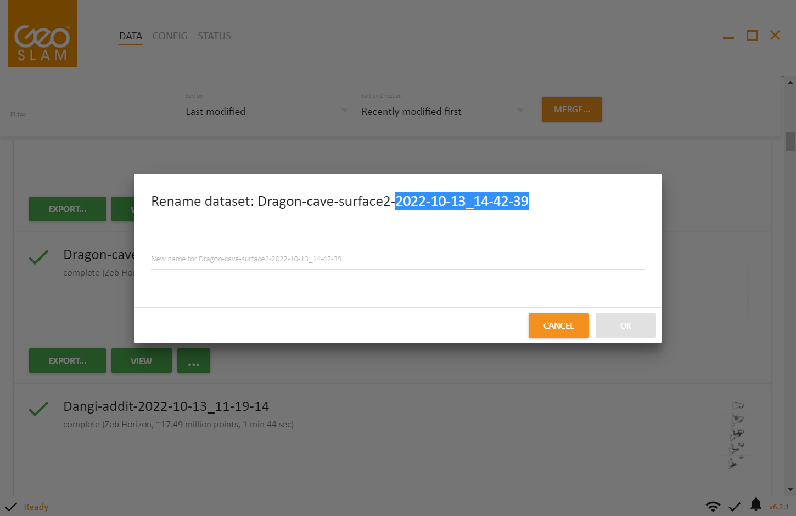 --->


### Viewing the scan using HUB

Under the scan's name, click the `View` button. This opens a new window, a 3D viewer where it is possible to navigate the point cloud using mouse controls.

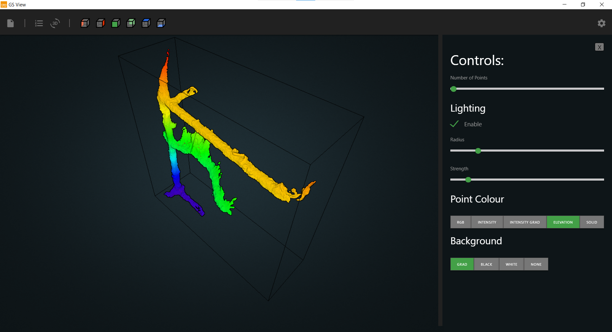

By clicking on the folder icon on the top left of the image, and pressing the `Hide/Show Notes` switch you can bring up the reference points taken during the scan.

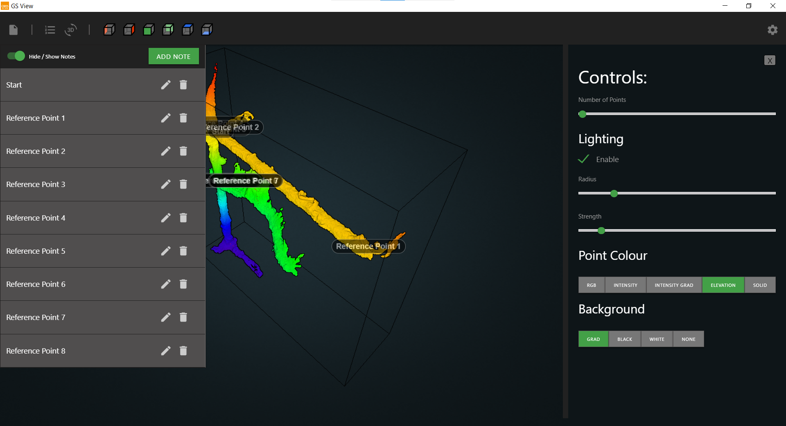

By default, not all scanned points are displayed on the screen (this is to help with the software responsiveness), but you can increase this with a cursor on the right.

You may also change many parameters of the display to suit your needs. 

_The main point of this first visual inspection is to make sure that the scan processing was successful. Does the cave/mine/surface look like what it should?_

### Reprocessing a failed scan

Sometimes, the default geoSLAM processing parameters are not suitable, resulting in a spurious point cloud where certain features are merged together or repeated hundreds of times.  Sometimes, you will also see so spurious data points around the expected edges of the cave/mine passage. 

You will likely need to reprocess this scan by tweaking the processing parameters a little.

To do just this, click on the green three dots button and bring up the `Reprocess` dialog.

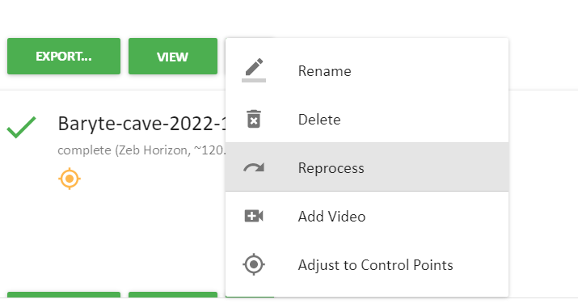

If you see many repeated features, it can sometimes mean that the algorithm relied too much on feature matching to compute the location and orientation of the LiDAR sensor. To address this, it is helpful to change the `Rigidity` cursor to negative values, increasing the algorithm's reliance on the internal motion unit of the scanner instead. 
Adding to the processing time, but also helpful, the `Convergence Threshold` can be increased by a few notches.

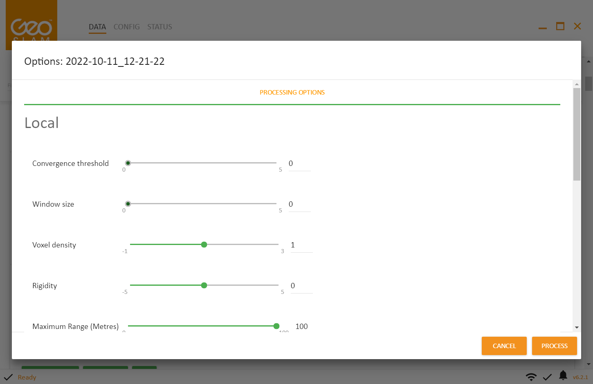

Click `Process`.

### Georeferencing the point cloud in HUB

Here, you will match the traditional survey data with the reference survey stations from the scan. 

The first thing to do is match survey names (any alphanumeric code) with reference point names (numbered consecutively from 1).

Open the `CaveSurveyData` folder in your editor (like Visual Studio Code). You should already have a file named `<CaveName>_StationsQuery.tab` which lists the station names and the absolute X, Y and Z coordinates of each object. 

Create a new empty file called `<Survey>_FixedPoints.tab`. Identify and match each reference point with the station name. 
To keep track of things, you should order the points by the number of the control point in the scan.  The first line of the file could reflect that, with a comment.

After these comments, copy and paste relevant lines from the existing `<CaveName>_StationsQuery.tab` file. Prepend `CP_` for control point to each station name.

```
# Reference Point 1: <D>
# Reference Point 2: <A>
# Reference Point 3: <C>
...

CP_<D> X Y Z
CP_<A> X Y Z
CP_<C> X Y Z
```

Once you have matched reference points with station names in this way, save the file `<Survey>_FixedPoints.tab` and navigate back to HUB.

Select the green three dots and navigate to `Adjust to Control Points`

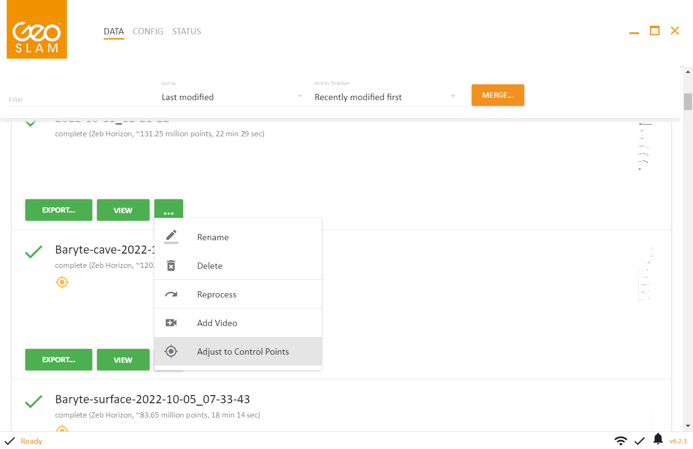

Open the `Import Positions` dialog, and choose as your input the `<Survey>_FixedPoints.tab` file. 

For each reference point, click `Select ...` and you should see several options, `Exclude`, `Manual` and a list of named control points `CP_<Station>`. Choose accordingly until all reference points have either been excluded, or been assigned a station name and its real world coordinates.

Click the previously greyed out `Non Rigid Adjustment button` and wait a little as the cloud is being reprocessed.

 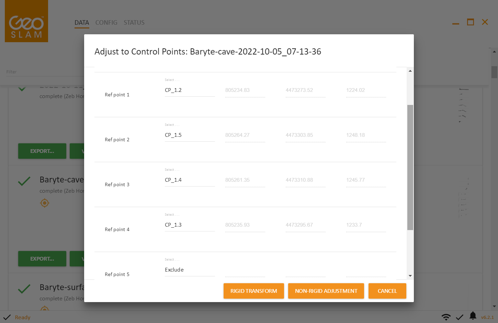

When the cloud is successfully geo-referenced, you will see a little orange target appear below the name of the scan. Clicking on it, you should bring up the accuracy report. Click `Save Report` and save to a file called :  `<Survey>_FixedPoints_ErrorAssessment.tab`

Depending on the accuracy of the survey, the RMS error could reach up to 30 cm, but best is to keep the RMS below 10 cm. 

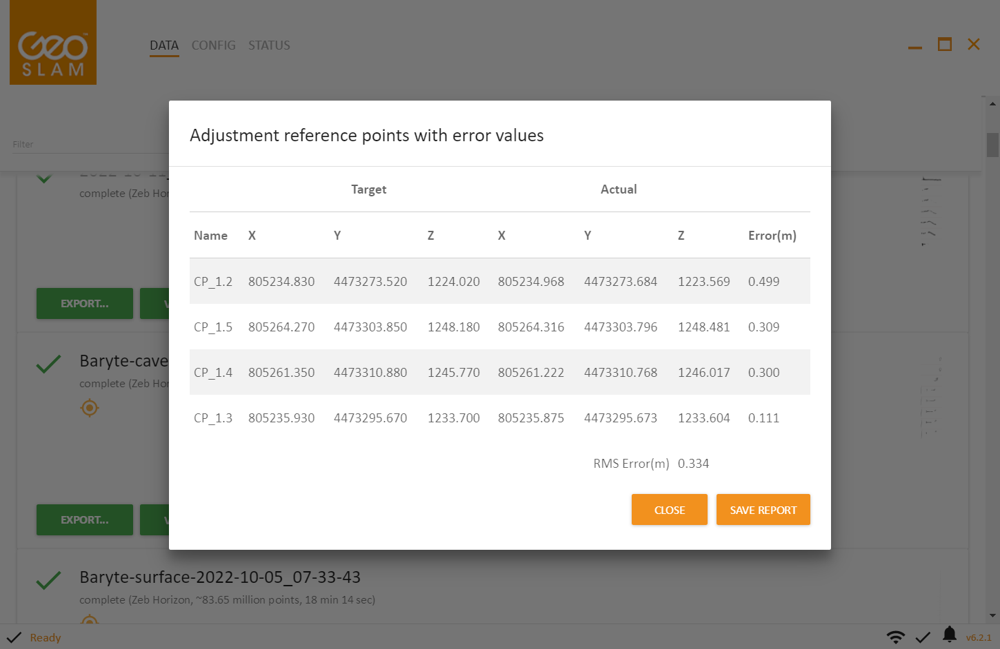

_That's it. We do this first geo-referencing in HUB to generate and keep a copy of the error assessment. Creating the file containing fixed points is also crucial later on._


### Exporting a cloud for CloudCompare

#### On GeoSLAMHub
Click on the green `Export` button underneath the scan name and navigate first to `Reference Points`. Tick the box `with reference based offset`. 

Choose the folder location and create a new directory in your workspace called `GeoslamExports`, add a subfolder for the cave, and within, another subfolder called `ReferencePoints`. Click `Save`. This will save a table (tab delimited text file) with the following name: 
`<CustomScanName>-<Year>-<Month>-<Day>_<Hours>-<Minutes>-<Seconds_with_ref_base_offsets.txt>`

This is a table which contains the original point cloud information in local coordinates about each reference point.

In HUB, click again on the green `Export` button underneath the scan name and navigate to `Point Clouds`. This opens a new window in which you can define a series of different outputs for each scan. For future use, we will export to `PLY` format, using between 50 to 100 % of the points. Change the point colour from `Time` to `Shaded`, the `Scan` timestamp and tick the box `point normals`. This last one is needed to produce a mesh from the point cloud in CloudCompare.

Click the `Add+` button and select a folder location and create a `PLY_Normals` folder, select this and finally click the green `Export` button. This may take a little while. You can export several different scans at once however.

 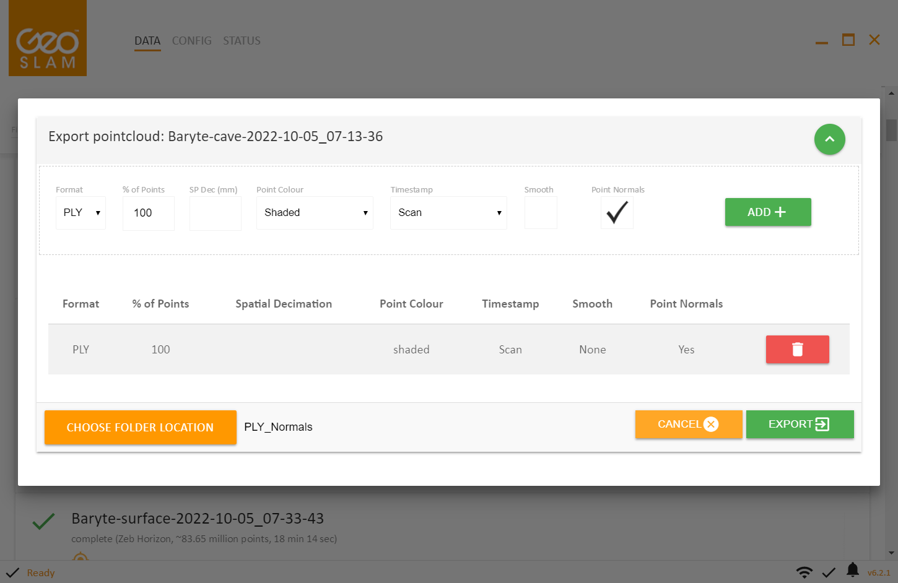

## The GeoSLAM Connect workflow

### Opening the geoSLAM processing software
Double click on the GeoSLAMConnect icon on your desktop and open the software. The following home screen will be displayed.

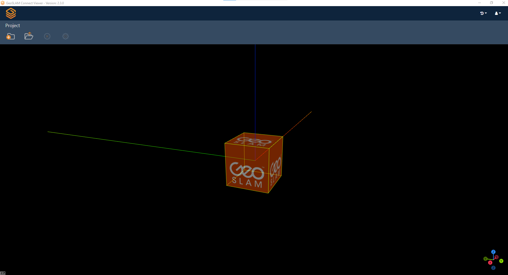 

### Adding raw files to be processed

On the top left corner of the window, you will see a folder icon with a "+".  You can use this to create a new project folder, within which related scans belong. 

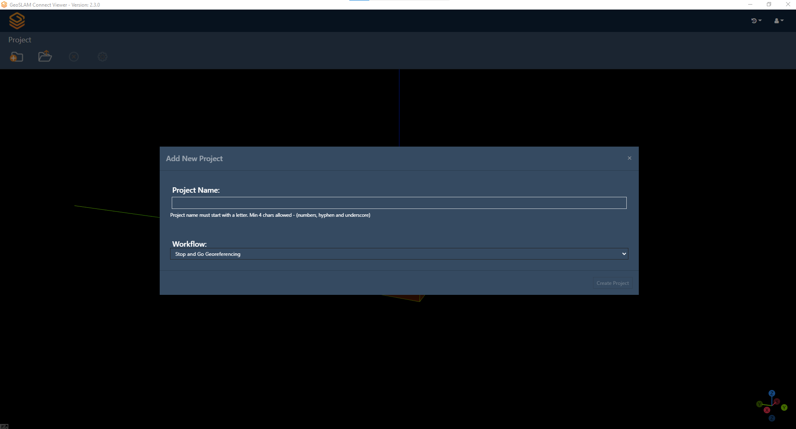 


Previously processed scans reside in existing project folders (denoted by the open folder icon). 
When creating a new project, it is possible to customise the default processing workflow. If you have collected some reference points in the field and held the scanner to those points for a good 10 s, then you can use the _Stop and Go Georeferencing_ workflow. Otherwise, it is also possible to choose the standard SLAM processing. 


If you are adding a new scan to an existing project, it is important to rename the `.geoslam` file you wish to be processed before dropping it in the _Drop \& Browse_ tab on the top left. If you are using the _Stop and Go Georeferencing Workflow_, make sure you also have a formatted control point file to hand.

Any text file with the following format is suitable: 

```
CP_1, xx1, yy1, zz1
CP_2, xx2, yy2, zz2
```

In the import window, you can specify the control point file by browsing the system.

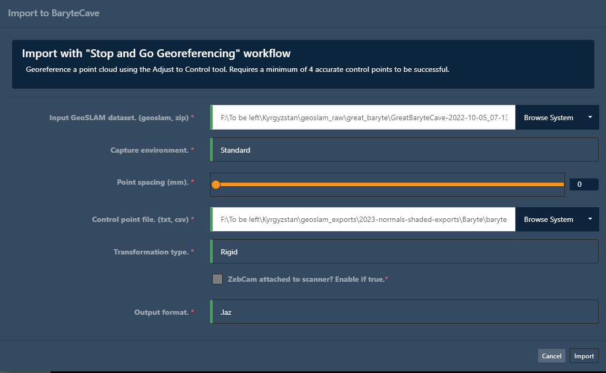 


The next step takes several minutes, depending on the size of the scan. 
Sometimes, the control points are not recognised by the software and the alignment step fails. 
However, the stop and go alignment can be performed at a later stage.

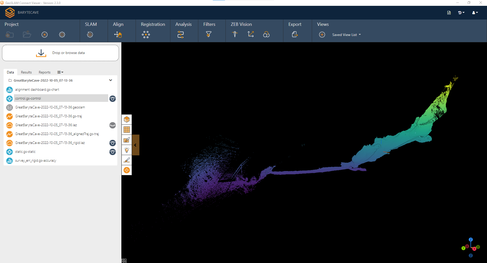 

### Stop and Go Georeferencing

This step works for any dataset processed using the standard GeoSLAM workflow. 
You can go in the registration tab and select the appropriate georeferencing workflow. If you have independent measurements of geo-referenced targets, you can choose _Stop and Go Georeferencing_


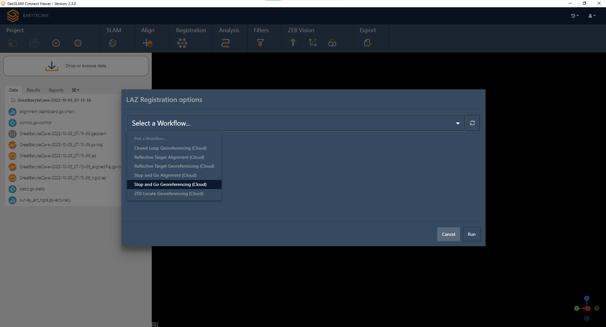 

Within the next dialog, you can choose the `.laz` file to be geo-referenced. Enter details about the original `.geoslam` file, the trajectory file `traj.txt` and the file containing the control points. 

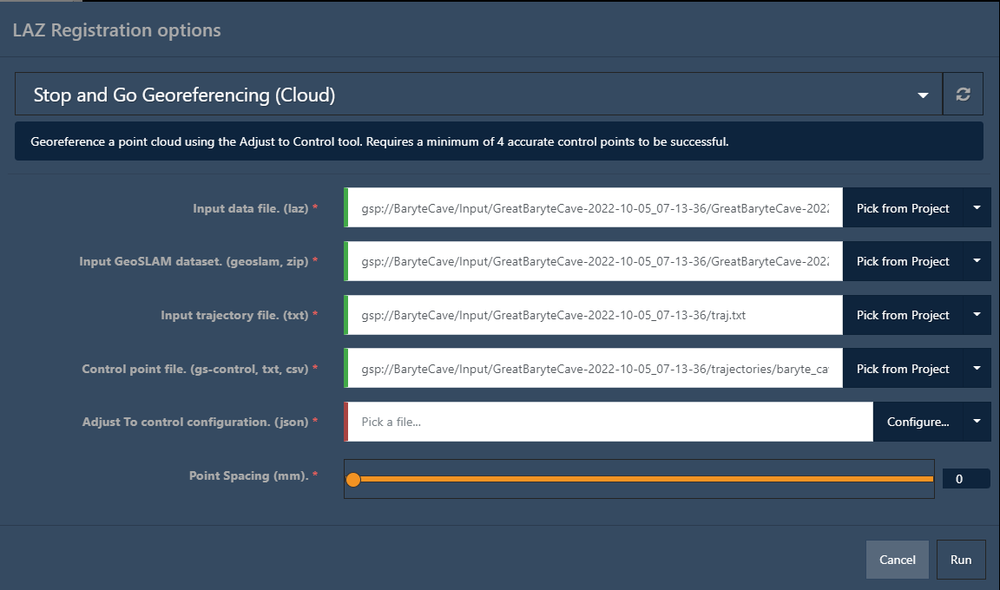 

Finally, you can click on the _Configure_ button to open the adjust to control dialog. There, you will be able to visualise the velocity recorded by the IMU sensor within the ZEB horizon during the scan. Reference points are automatically detected whenever the sensor is held still for a set duration (usually about 10 s). Play around with the different thresholds for the detection of reference points (e.g., the max IMU velocity to be considered, the min period during which the scanner was immobile). Click _Read Data_ to automatically detect the points. 

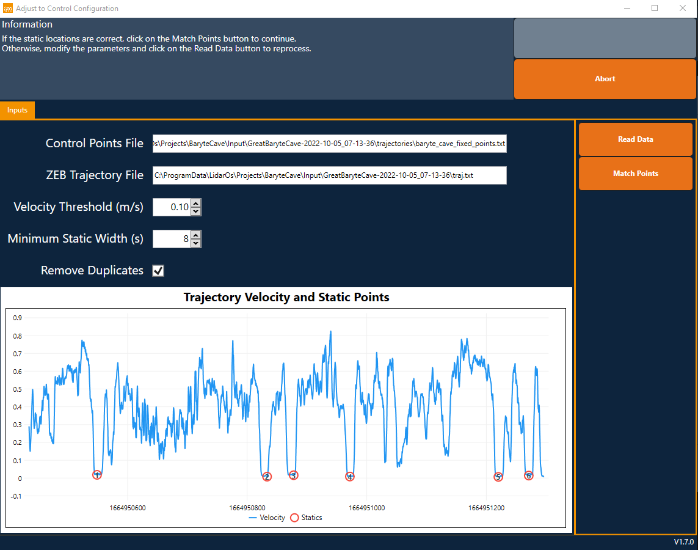 

You may now click on _Manual Match_ to select pairs of matching points. You need at least four points for a successful alignment procedure. You can then click _Align_.

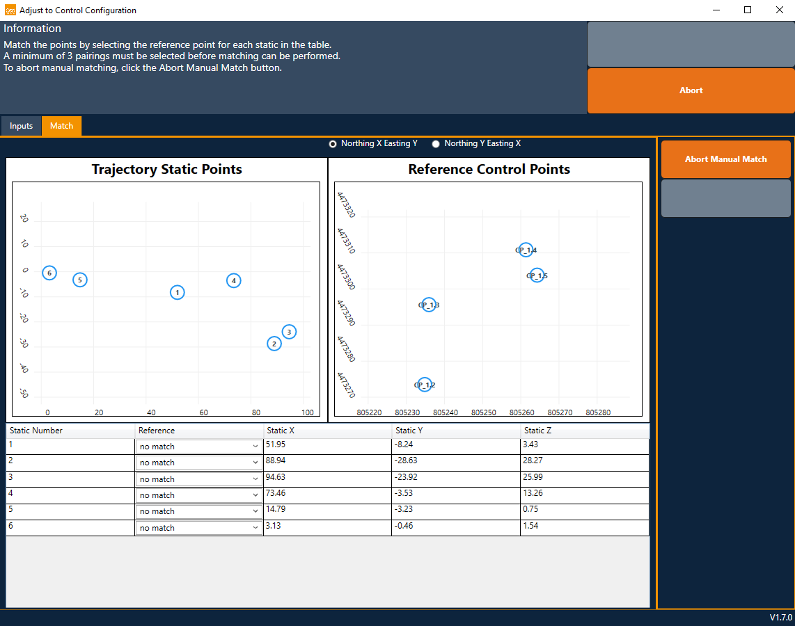 


If the alignment procedure is successful, you will see the residual distance between the aligned reference points and the controls. You can then click _Configure A2C_, choosing the `Rigid` method and `Horizon` scanner type before clicking _Accept Configuration_.

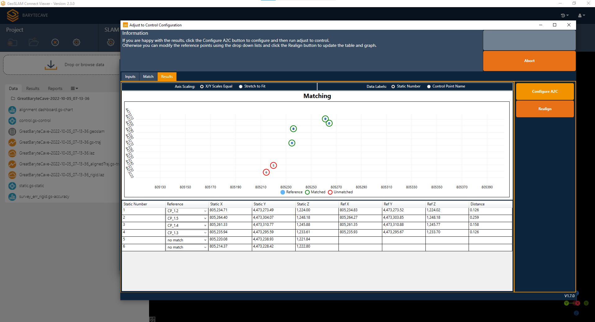 

Finally, you will be redirected to the starting menu where all that remains to be done is clicking the button _Run_ to launch the workflow. All configuration settings for the georeferencing are then stored in a `a2c-helper--{date}.json` file.

Once the workflow is successful, a slew of new files will be available on the data panel of GeoSLAM connect, especially four files with blue icons. 

They are: 

1. the `alignment dashboard.gs-chart` which enables a quick browsing of the various georeferencing errors
2. the `control.gs-control` which toggles the visibility of independently measured control points in the scene. 
3. the `static.gs-static` which toggles the visibility of the reference points within the scan.
4. the `survey_err_rigid.gs-accuracy` which brings up a tab with the table of x, y, z and normed error of the points. 

Last but not least, the aligned point cloud is stored with the prefix `aligned_{scan name}.laz`. 

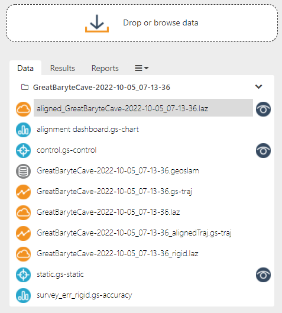 

### Manual alignment of scans 

In some cases, where several scans of a single passage with sufficient overlap are made, it is possible to use a Manual Alignment workflow, whereby the user aligns the scans roughly together and lets the algorithm do the fine tuning to minimise the distance between the two clouds.

The procedure is detailed below.

Opening the alignment tab, you can choose the datasets to be aligned (two at minimum, one being the reference, the other to be aligned).

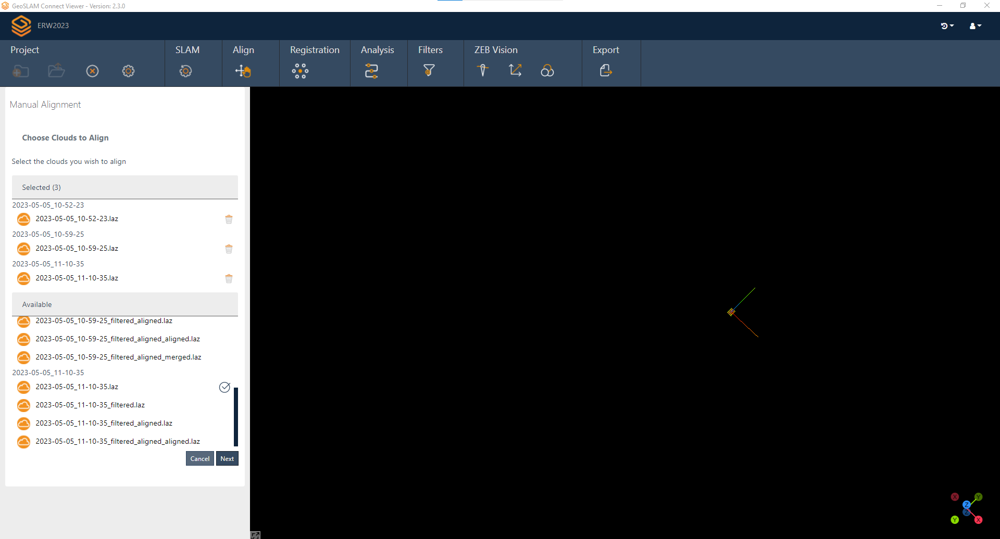 

One the files are chosen, you should specify which is to be the reference by clicking the target icon.

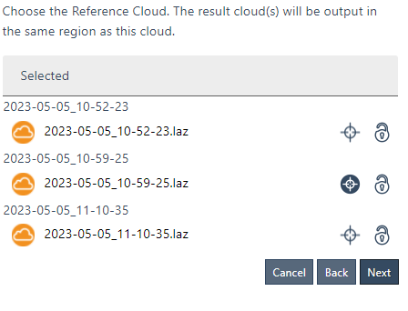 

At the next (optional step) it is possible to also select the trajectories to be aligned. This is necessary if the ZEB Vision was enabled during the scan.


The next step is to choose whether a merged output cloud is desirable. Check the box if necessary.

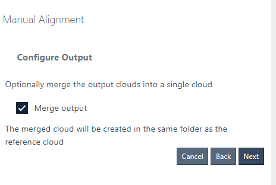 

The selected files will then be loaded into the scene. Minimal realignment will be needed if the different scans share the same starting / finishing point. 
Each scan will be colored differently to enable the realignment procedure. This step only involves rotation or translation of the point clouds, no scaling. As far as possible, using the top and side views iteratively is preferred.
If aligning three scans of a linear cave passage, it is better to set the middle scan as the reference. 

Below is an example of unaligned scans. The orange part should be the middle scan. Since it shares the same starting position as the yellow scan, those two are already moderately well aligned. However, the green scan is neither in the correct position or the correct orientation. 

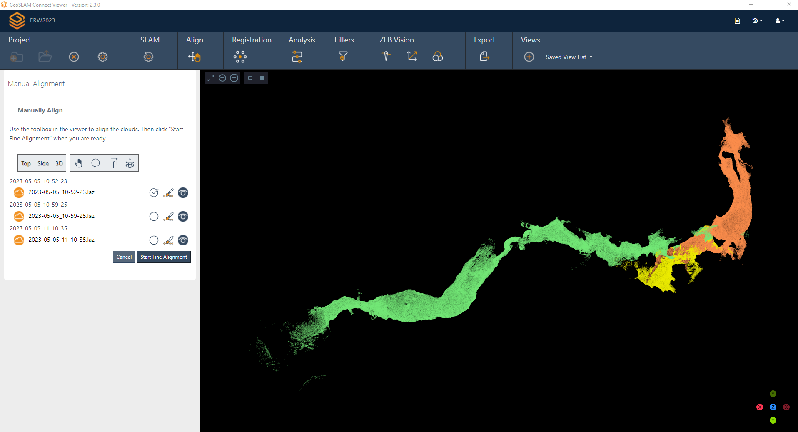 

In side view: 

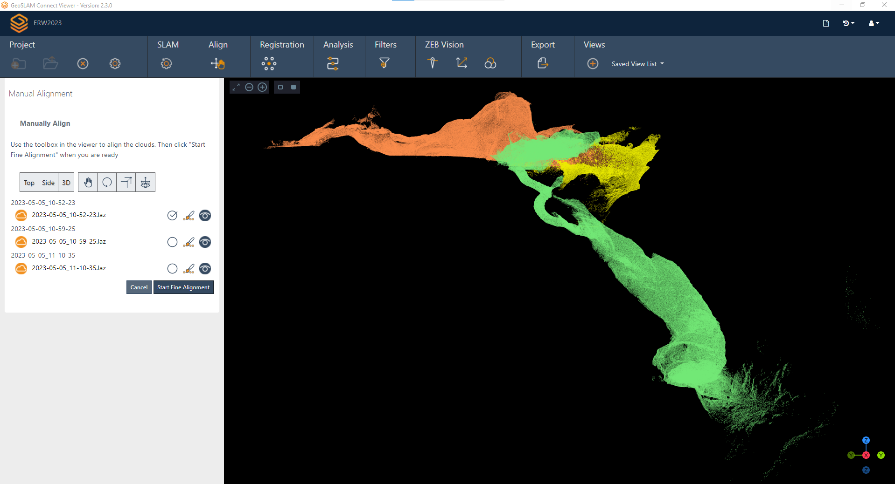 

##### The translate tool
Simply click on the hand, place the target and left click. Some hairlines appear, together with a small square. By clicking and dragging this square, it is possible to translate the scan in the XY plane if in _Top View_ and in the YZ plane in _Side View_.

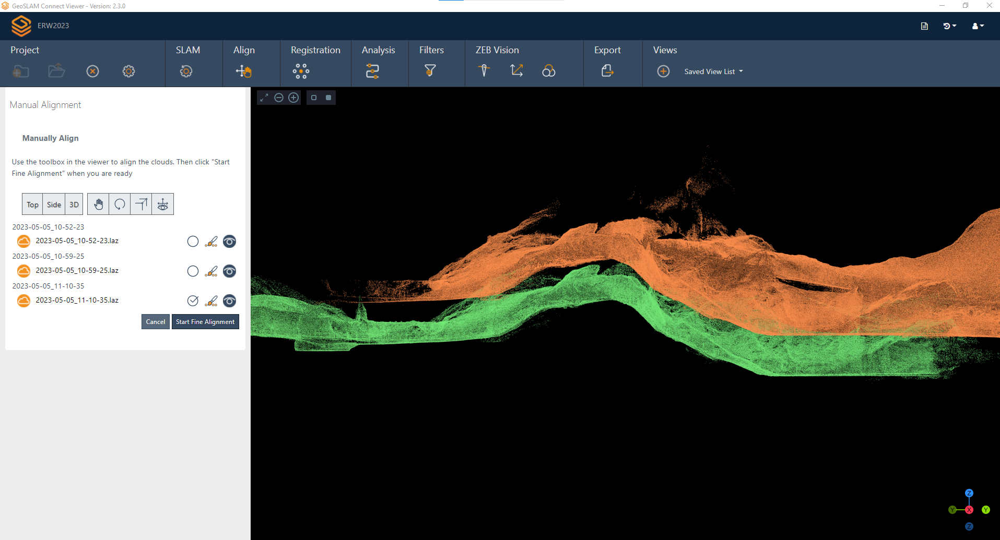 
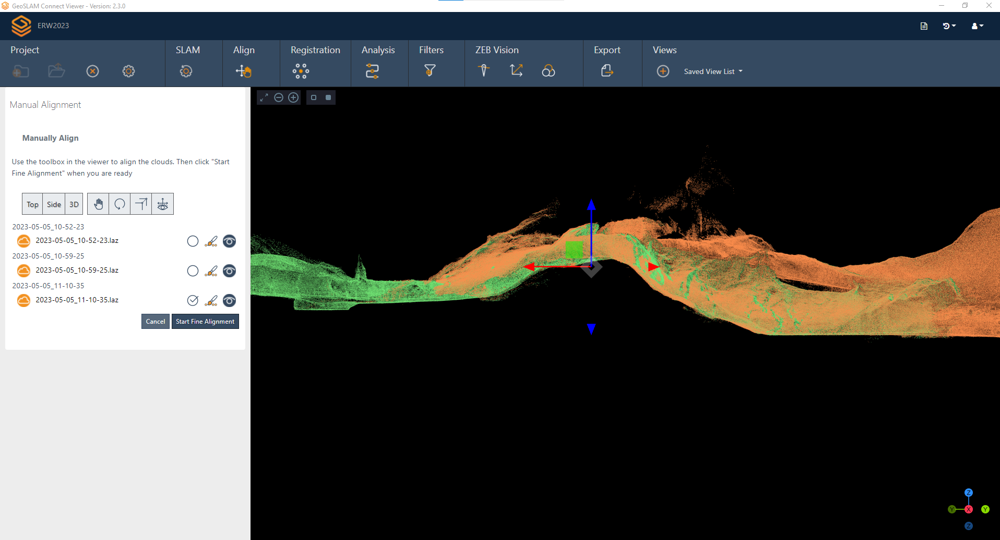 

##### The rotate tool
Simply click on the circular arrow symbol, place the target at the centre of rotation. It's easier to find an easily matching passage corner and overlay the features on both scans by translating the scan first. Then place the centre of rotation on the matching feature and rotate the point cloud by dragging the cursor appropriately.

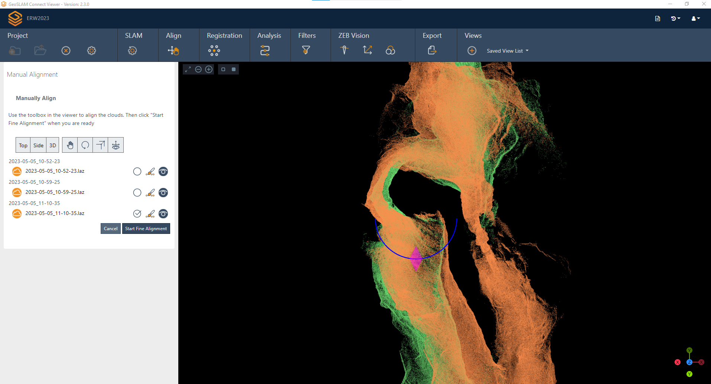 
 


The following workflow for manual alignment is recommended: 

1. Starting in _Top View_, align one prominent feature the scans have in common with the translate tool. 
2. With the rotate tool, align the two scans. 
3. Then in _Side View_ adjust the vertical position of the scan to be aligned.

You can now click _Start Fine Alignment_, which will produce new aligned point clouds. These files have the suffix `_aligned.laz` added to the root filename. 
In the reference scan folder, you will find a scan with the suffix `_merged.laz` if you chose to produce a merged output.

### Exporting the files 
There is no need to export new laz files, as these can already be found on the desktop by right-clicking on a certain file and clicking the _Open File Location_ button.

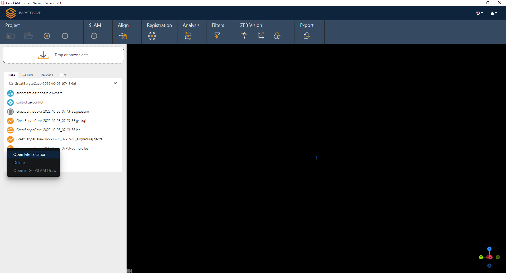 

However, should you want to export a `.ply` file where normals are already computed (this is necessary in order to compute an appropriate mesh of the dataset), then, you can browse the _Export_ tab on the home screen of GeoSLAMConnect. 

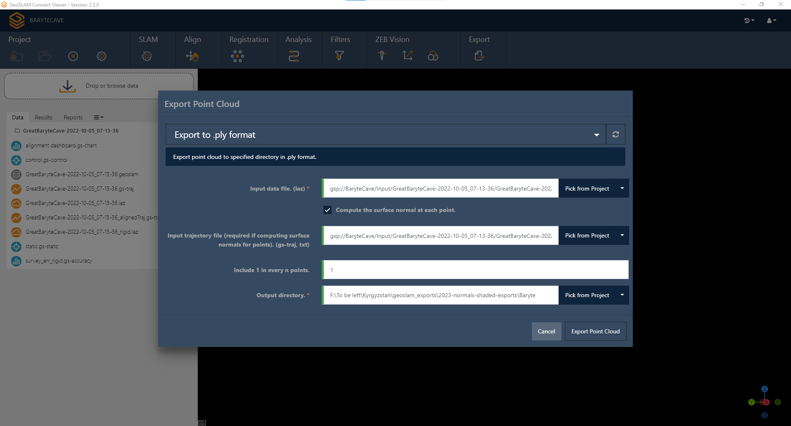 

_Congratulations you've made it so far! We're about to leave HUB or Connect and continue our journey with the software called CloudCompare_


## Manipulating the point cloud in CloudCompare


### Create a transformation matrix for georeferencing

####  Opening the PLY file in CloudCompare

On the CloudCompare home screen, navigate to the open folder symbol and select one of the PLY files exported in your workspace.

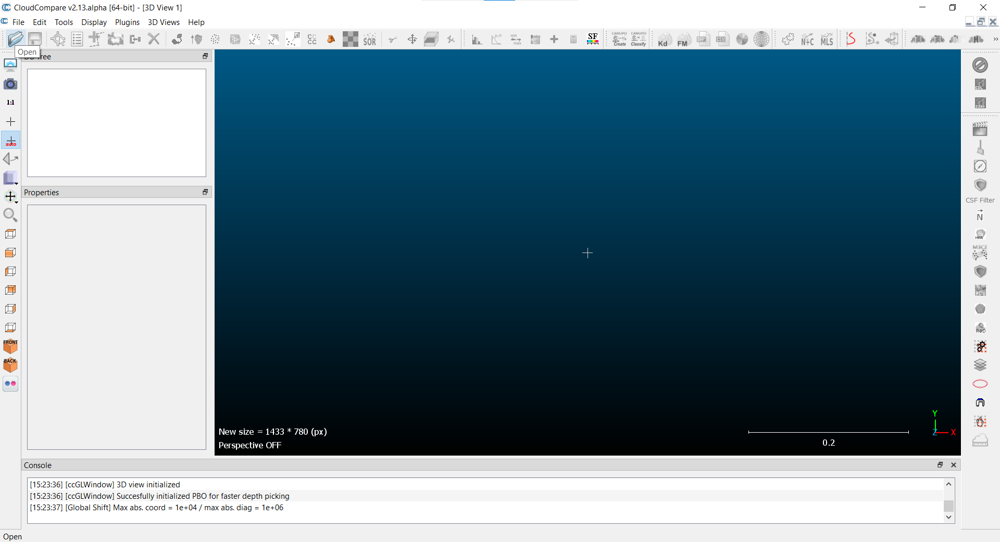 

####  Loading the fixed points from the traditional survey

Open first the `CaveSurveyData/<CaveName>/<CaveName>_FixedPoints.tab` file with Cloud Compare.

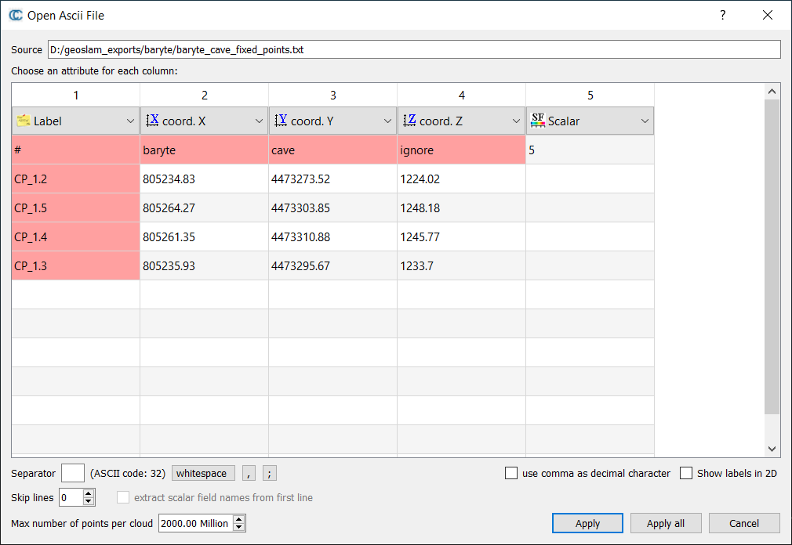 


This opens a window dialog where valid columns or rows are displayed in white, while those that could not be successfully parsed are highlighted in red. In the bottom left, you can choose to skip header lines empty of data. Enter the number of lines to skip, until all red rows disappear. Check that the column headers are correctly parsed i.e., that X, Y and Z coordinates correspond to the correct columns. The label column may remain red; the rest of the workflow will not be affected.

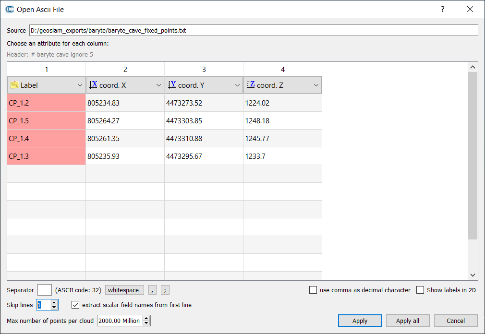 

Click `Apply`. This brings up another dialog, with some suggested shifts from geographical coordinates. If you are using a projected, metric coordinate system (UTM or similar), you can accept the suggested shifts in the X and Y directions. It's important to note what this shift is, as it will be used on all connected bits of cave. Make sure the shift is to the nearest km (_XXX000.00_, _YYYY000.00_). The Z shift should be kept at 0. Keep a copy of this numerical shift somewhere for future reference. 

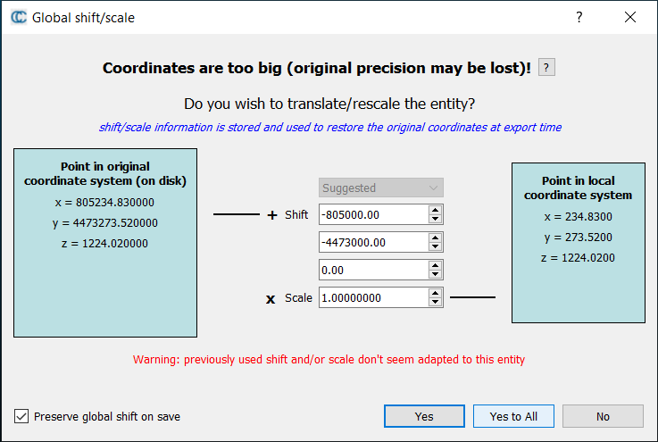

Proceed with `Yes to All` and you should now see the control points loaded on the screen, with their labels. By default the camera is set to a top-down view (plan). 

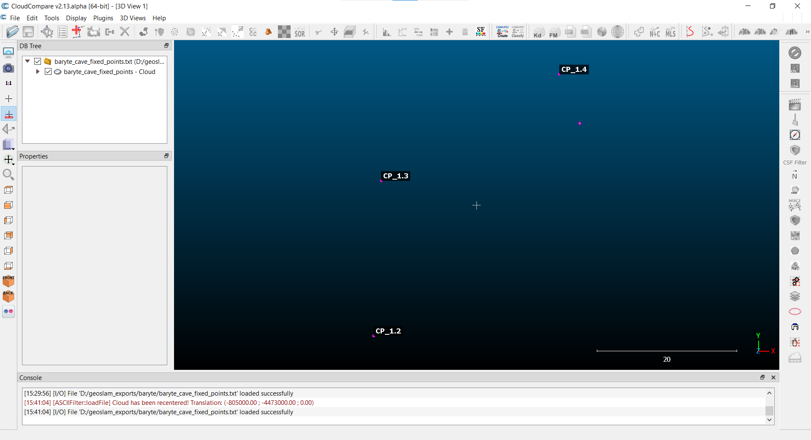

It can be helpful to resize the point size of this series of labeled points. Select the cloud entity and look near the bottom of the left-hand side panel, where you can select the point size in a helpful dropdown menu. 

 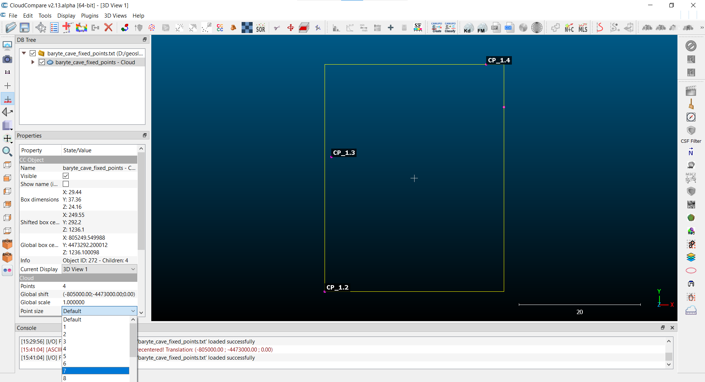 

####  Loading the reference points from the scan

You should open next the file called `GeoslamExports/<CaveName>/<CaveName>/<Survey>-<DateTime>_with_ref_based_offsets.txt` which contains the positions of control points measured during the scan (expressed in local coordinates). You can skip the first line of this table and click `Apply`.

 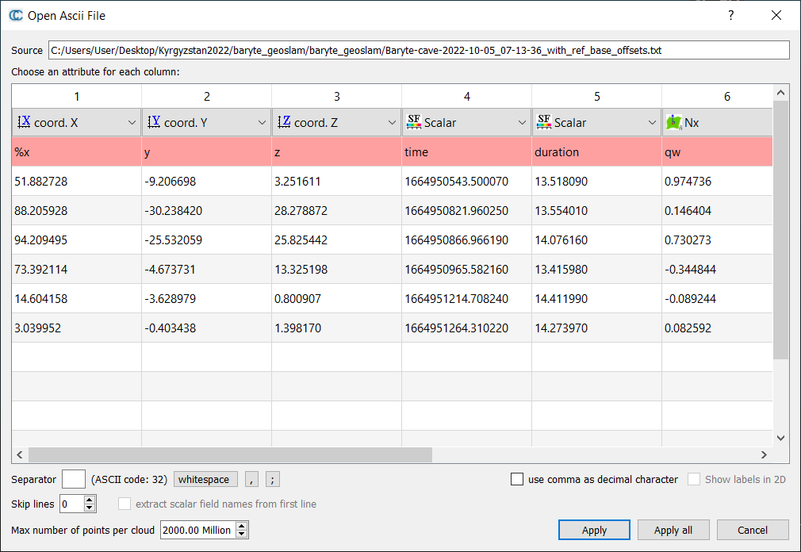

Resize the imported points to be a little bigger and you should now see two different series of points on screen. 

  

You are now going to calculate a 3D transform matrix between the two, which will be helpful to geo-reference the actual point cloud.


####  Aligning the scan control points to the traditional survey fixed points

To do this, we will first need to select both point clouds, starting with the cloud to be aligned, and ending with the one which will remain fixed.

Simply select one cloud, press Ctrl and left click once to select the second cloud. Now navigate to the align point clouds icon.

 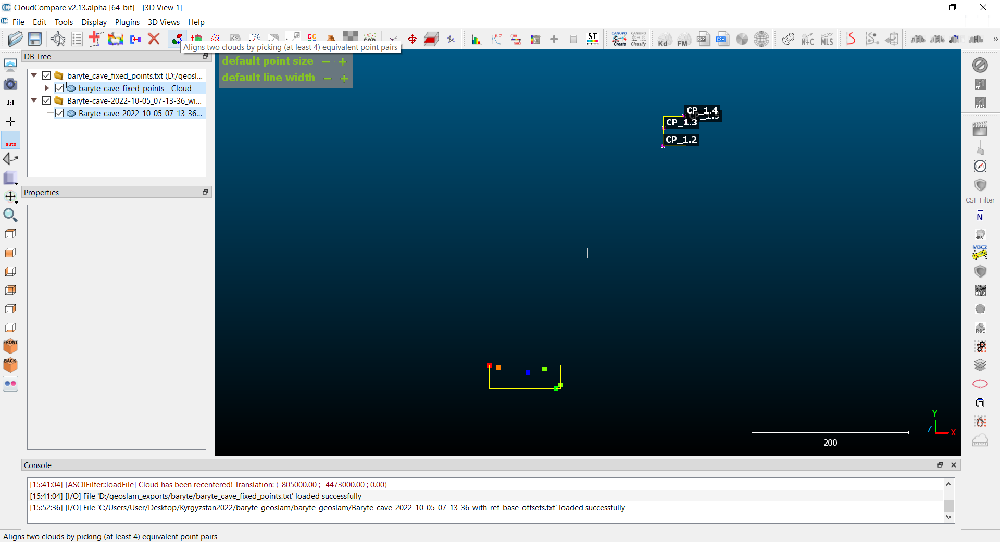 

This brings up a new dialog to double check that we have the clouds in the correct order and are aligning the scan control points to the fixed points and not the other way around! 

*As a reminder, pick the file ending with ref_based_offsets as your entity to be aligned* 

You will now see another dialog window pop up, which records the different points selected and their counterparts.


Now the trick is to select the relevant points in the same order in each point cloud, starting with the one to be referenced. The actual order of picking does not matter, but it must be the same in both clouds. Use the geometric pattern made by groups of points to help with this, as the two clouds will not be oriented in the same way to begin with.

As you click the points in the cloud to be aligned, a label will pop up (A0, A1, A2 etc.) As soon as you have finished picking your points to be aligned, you can pick the respective fixed points (R0,R1,R2, etc.). Note: you do not need to select every point in the scan's control point, only those that match the fixed points.

 
 
And for the fixed points:

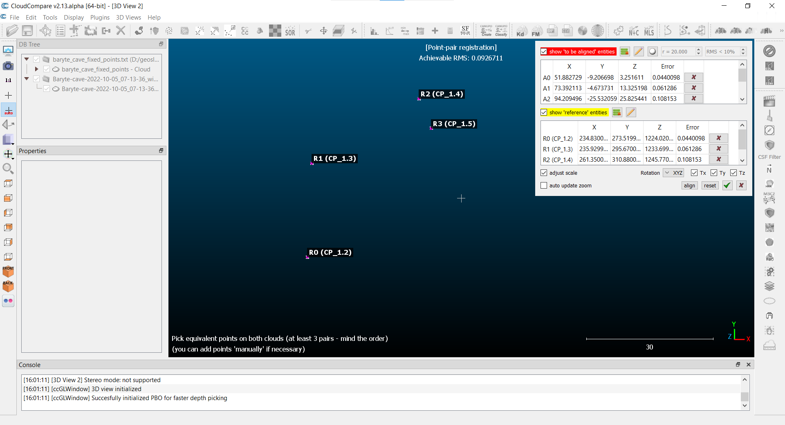

Select the `align` option (this moves the reference cloud over to the actual geographical coordinates) and then click the green tick. Click `ok` on the next dialog. A pop up will appear with the coordinates of the transformation matrix. You may close it as those coefficients will be saved elsewhere.

To save the transformation matrix, drag the edge of the console panel at the bottom of your screen and look for the following line: 

``` 
[Point Pair Registration] Applied transformation matrix 
``` 

To be able to reproduce the geo-referencing transformation, it is best to copy and paste this matrix to a new file. One way is to create a file called `GeoslamExports/<CaveName>/GlobalOffset.txt` for the first cave scan.  Copy and paste the following four lines to a new paragraph, with a description of which segment of the cave this refers to, remove the timestamp between square brackets on the first line and save to:
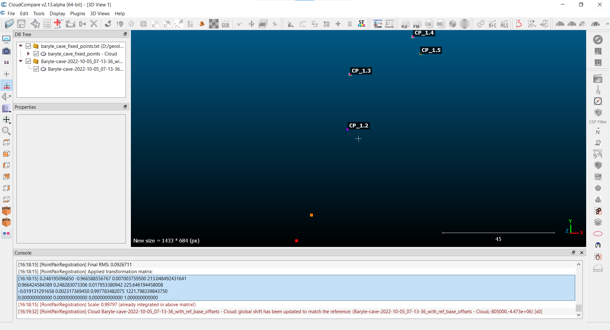


####  Loading and transforming the PLY file

Open the `GeoslamExports/<CaveName>/PLY_Normals/<Survey>-<DateTime>-normals.ply` file in CloudCompare. In the next dialog window, click `Apply All`

 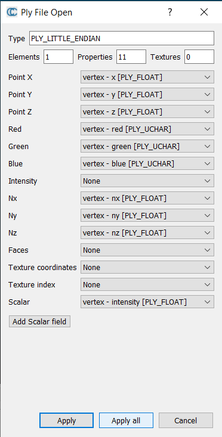


The point cloud will appear in the program window but it is not yet geo-referenced.  You can turn on the aesthetically pleasing shading by navigating to `Colors` and choosing RGB in the object's properties panel. 

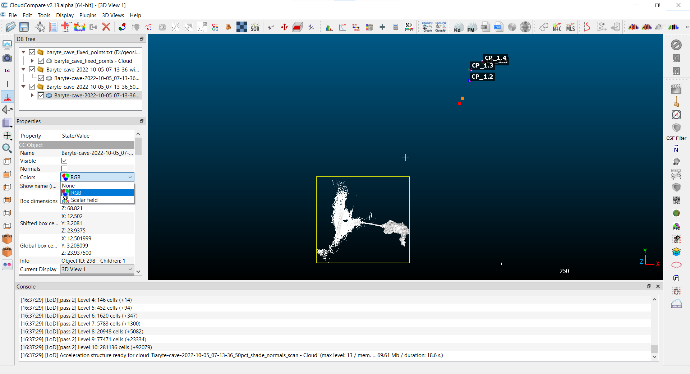 

Now we are ready to geo-reference the point cloud.  Start by selecting the cloud entity and navigate to `Edit -> Apply Transformation`. 

You will see first an identity matrix, update it by copying and pasting the matrix saved at `GeoslamExports/<CaveName>/<Survey>-TransformationMatrix.txt`. 

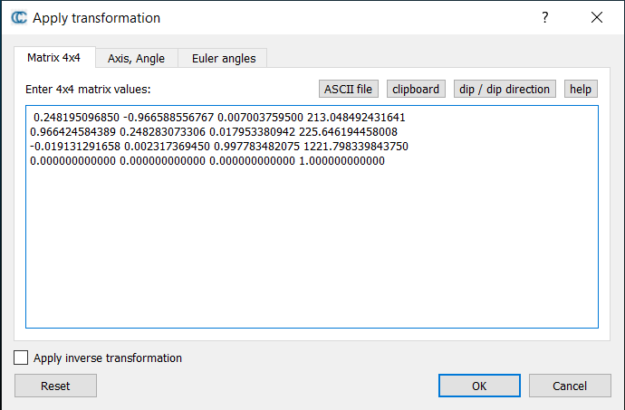

Click `ok` and watch as you point cloud orientation now matches that of the control points. Repeating this step for the various cave scans will soon build a fuller picture of the cave. 

 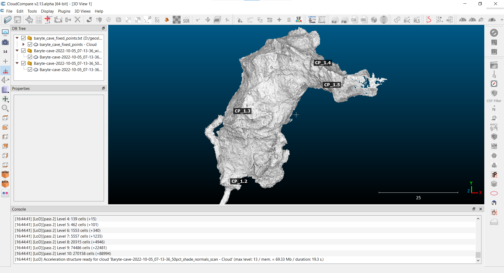


### Scalar fields 

Point cloud files are essentially big tables with the following attributes for each point: 

1. X,Y,Z coordinates
2. R,G,B values of colour
3. integer classification
4. other "scalar fields"

In CloudCompare, it is possible to colour a point cloud according to elevation by exporting the Z coordinate of the pc to a separate scalar field. 

This is done by selecting the appropriate point cloud and running the following workflow: 

```
Edit --> Scalar Fields --> Export Coordinates to SF --> OK 
  ## make sure that only Z is selected.
```

 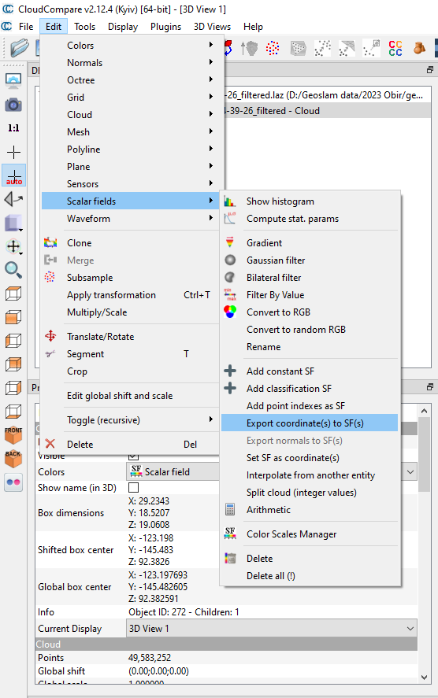


### Segmenting the point cloud and classifications 

A powerful tool in CloudCompare is the ability to classify different regions of the point cloud as being distinct. For instance any scan involving parts of a cave, entrance adit and surface will likely benefit from being classified as such, if only to be able to quickly highlight certain parts of the scan as relevant. 


To achieve a classification, two workflows are possible: one relies on manual segmentation of the cloud, the second is an automated workflow leveraging a user-defined and trained classifier. 

#### Manual classification through segmentation 

Select first the point cloud to be segmented and classified, then navigate to the segmentation tool (red pair of scissors). You can define polygon selections and either keep the inner or outer region. At each step, the segmentation pauses, during which it is possible to reorient the view and continue refining the selection. Clicking the green tick then confirms the current selection and splits the point cloud into two regions: segmented and remaining. 

Selecting one of the segmented clouds, you can navigate to: 
```
Edit --> Scalar Fields --> Add classification as SF
```

and enter an 8-bit integer value for the classification (0 to 255). In LiDAR generated point clouds in LAS format, some integer values are already tied to specific categories, like ground points (1), low, medium and high vegetation (2,3,4) etc. 


#### Automated classification using CANUPO classifier 

Select the point cloud where training samples are to be defined. 
Open the segment tool and start selecting areas which are to be classified a certain way. For instance, circle around some clearly defined bushes on a certain scan and press _segment out_ button after each bush. This will gradually cut out the training samples from the cloud. After each cut, move around, find another sample, unpause the selection and cut out the next one. 

 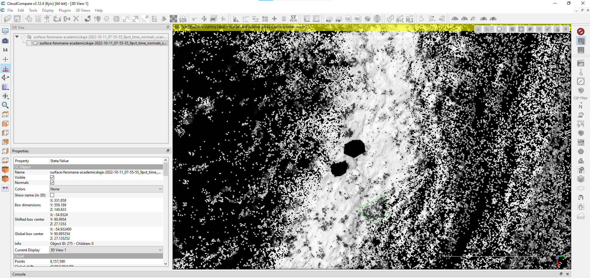

One you have enough representative samples, press the green tick to confirm the segmentation, which will produce two clouds: the segmented group, and the remaining samples already cut out. You can rename the cloud to whatever you wish. 

You can select the other end-member of the classification, in this case, instead of bushes, find clear examples of clean surface and select a few areas to be cut out.

Eventually, you should end up with two clouds containing small representative sub-samples of the original point cloud.

 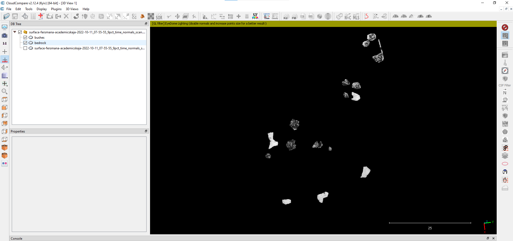


To train the classifier, navigate to: 

```
Plugins --> CANUPO --> Train classifier
```

 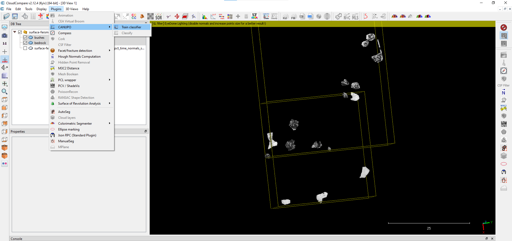


Within the dialog window, you will be asked to chose two point clouds representing the different end-members of the classification (classes #1 and #2 respectively). 

 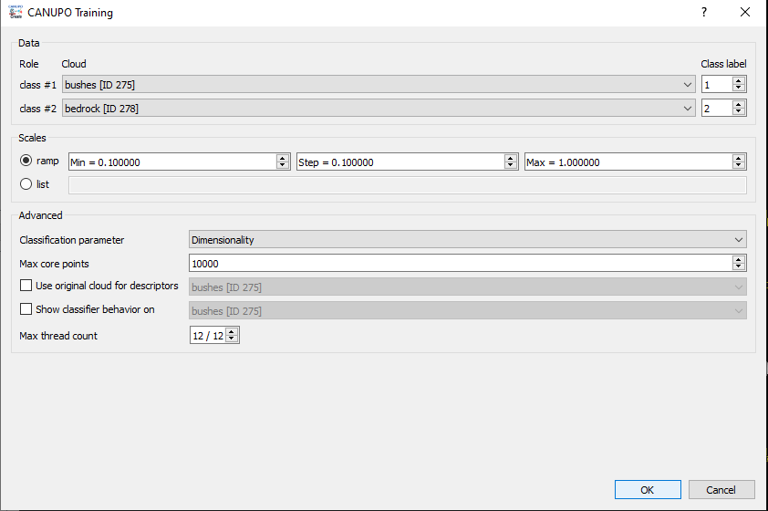


Press _OK_ to run the training algorithm. The result is displayed on the screen, together with some statistics about the classifier (it's easy to create a classifier, but harder to create an accurate one!). Look at the balanced accuracy criterion to check how many points are correctly classified or incorrectly classified.  


Once the classifier is trained, you may close the window and run the classifier on another point cloud by navigating to: 

```
Plugins --> CANUPO --> Classify
```

 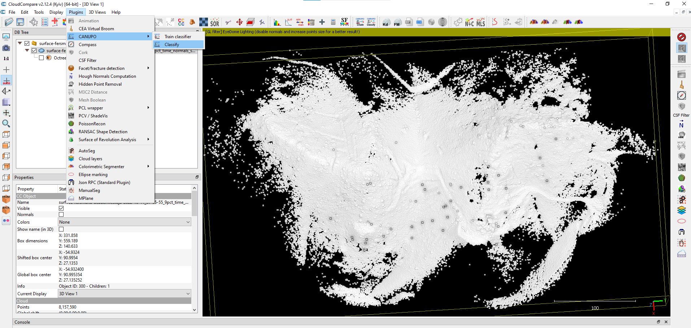


in the dialog window, keep the point sub-sampling box ticked as this will greatly speed up the classification workflow without great loss of accuracy. 

 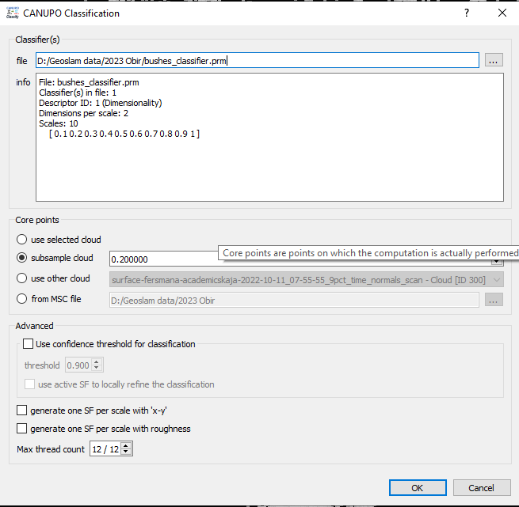


Once done, the point cloud contains two new scalar fields: the CANUPO class (in this example 1 for bushes, 2 for ground). 

To create a "clean" ground dataset, it is possible to get rid of the vegetation by splitting the cloud by its unique integer values of a scalar field, in this case, the CANUPO class. 

 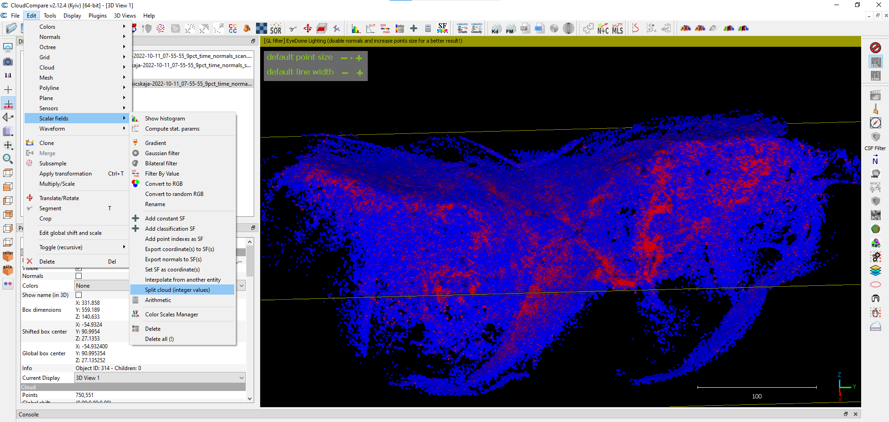

By splitting, one can then toggle the different parts of the clouds as desired to inspect the resulting geometry and potentially save the ground point cloud to another file. 

 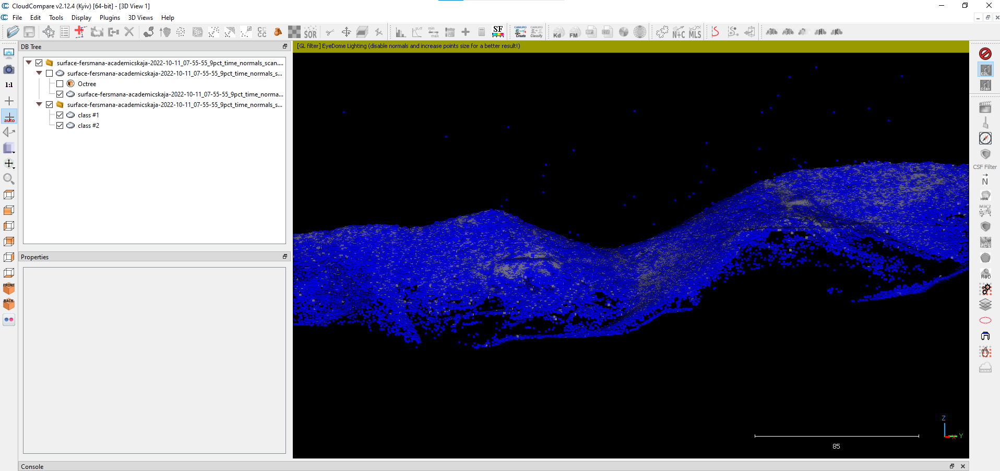

Turning off the vegetation class yields the following:

 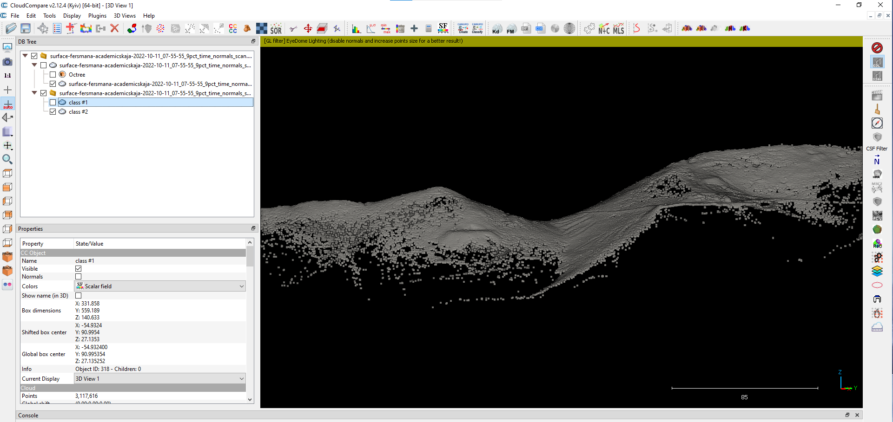

### Meshing 

For a point cloud to be meshed, normals need to be computed at each point. Fortunately, exporting a GeoSLAM file to PLY format with normals already takes care of this step. 
Otherwise, it is necessary to use the `Plugins --> Hough Normals Computation` algorithm in CloudCompare. In the dialog box, there are several parameters to check (for instance a greater neighbourhood size will increase the computation time but yield better results for cave scans).

Once normals have been computed, it is possible to mesh the point cloud using the `Plugins --> PoissonRecon` algorithm. By default the octree depth for the reconstruction is 8, but it can certainly be increased up to 12, after which the returns greatly diminish, due to exponentially increasing computation times. The meshes produced also increase in size and detail with increasing octree depth. One note of warning: reconstruction of closed surfaces will create bubble-like artifacts on the meshed surface. To display the mesh properly, one has to tick the "output density as SF" box before launching the computation.
By playing around with the displayed ranges, one can hide/filter out the low density areas (surfaces which are far from the original point cloud).


### Exporting visualisations

Once the point cloud or mesh is segmented/cleaned and ready for exporting to an image file, it is possible to navigate to `Display --> Render to File`. 

 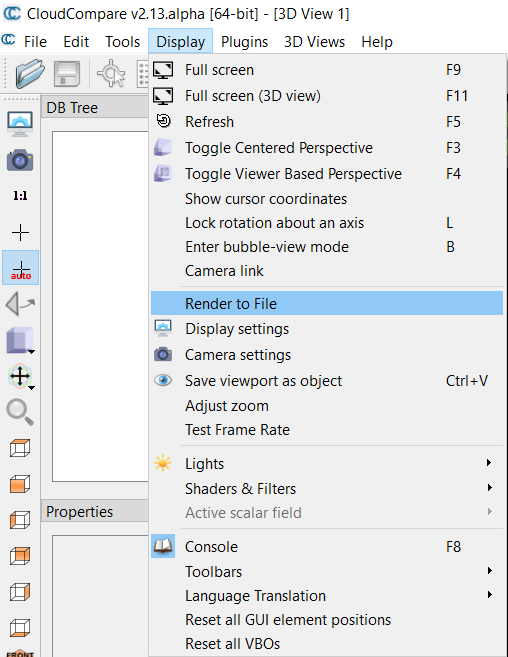

The path to the saved file and the file format can then be chosen at will. Toggling the zoom level allows high resolution files to be exported (resulting image sizes in pixels are displayed).

 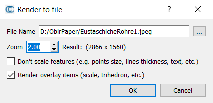


#### Cross sections

*To be finished...*

#### DEM of a cave floor in plan view

Split the point cloud as detailed above by selecting and segmenting out roof from floor. Select the floor of the cave and run `Tools --> Projection --> Rasterize (and contour plot)`

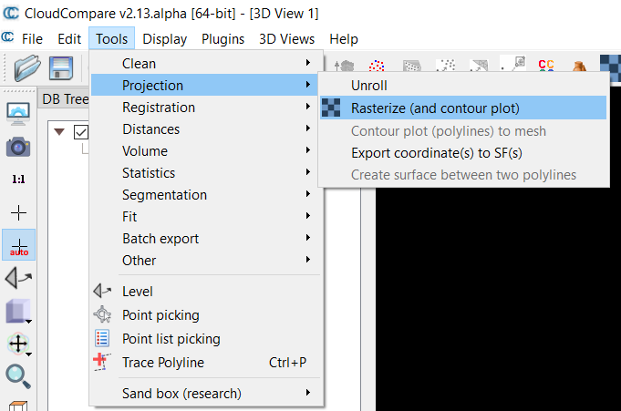

In the following dialog, you will be asked the pixel size for the raster output. Press the red  `Update grid` button.
 Leave the active layer as height grid values, and select hillshade in the tabs below and click `Generate`.
Adjust the grid size as appropriate for the best looking results (for a lidar point cloud, pixel sizes of 5 cm yield good enough results for mapping purposes). 

## Potree and point cloud visualisation 

In this section, a brief description of the workflow for processing a point cloud using the Potree converter, in order to make the point cloud openly accessible for visualisations. 

1. The classified point cloud is saved to `.las` or `.laz` format
2. The PotreeConverter.exe is run on the command line, specifying an output file with the syntax: `C\Path\To\PotreeConverter.exe -o Path\To\Output\Directory --generate-page <PageName>.hmtl` 
3. Using a local server (e.g. the node enabled live-server) with address 127.0.0.1:8080, the file can be visualised on a local machine.
4. Annotations, camera views, animations are set-up.


### Running the Potree converter

You can download the Potree converter executable on your Windows or Linux machine here: 

`https://github.com/potree/PotreeConverter/releases/tag/2.1.1` and select the corresponding executable. Save it and remember the path to this executable for instance, on a windows machine, you could save it to `"C:Program Files"`

To run this executable from the *command line* with the appropriate arguments, open a command prompt on Windows. 

 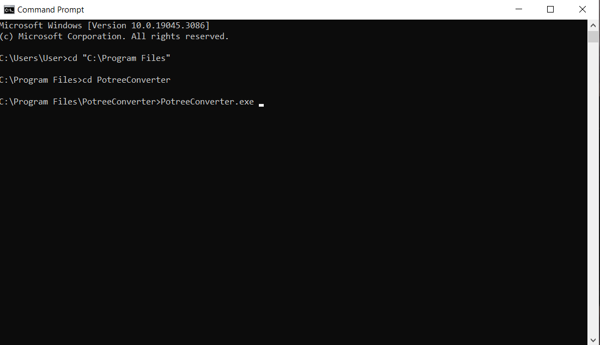

 Navigate to the Potree executable using the `cd` commands to change directory. If you saved it to `"C:\Program Files"`, then type simply `cd "C:\Program Files"` and press *Enter*.

 Next, enter the name of the executable followed by the necessary arguments, each separated by a space and their value. 

```
C:\Path\To\PotreeConverter.exe -o Path\To\Output\Directory --generate-page <PageName>.hmtl
```

This launches the algorithm for the generation of a directory containing the Potree files, within which you will see an html page.


### Visualising the cloud on a local server

Install `node.js` on your machine. For instructions on how to do this, please visit:

`https://nodejs.org/en/download`

This will enable your to use the *npm* command from your command prompt and install a quick an easy live server generator.


Open the command prompt and run the following command: 

`npm version`

 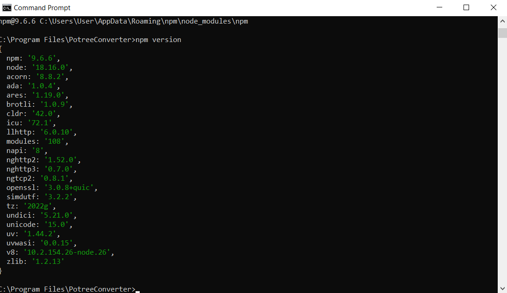

Then install the live-server by running the command:

`npm install -g live-server`


Once done, you can check the installation was successful by navigating to the Potree directory containing your new generate files and running the following command:

`live-server`

 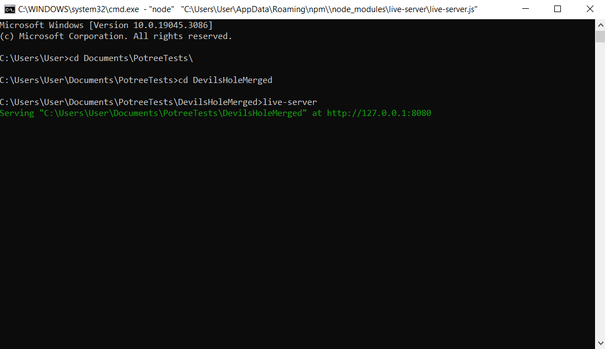

It should open your default web-browser window with a directory structure containing the html file linking to the cloud display. 


 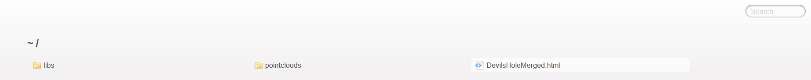


### Changing the appearance of the point cloud, adding annotations 

By clicking on the linked html page, you will navigate to a tab which displays the default point cloud. 

 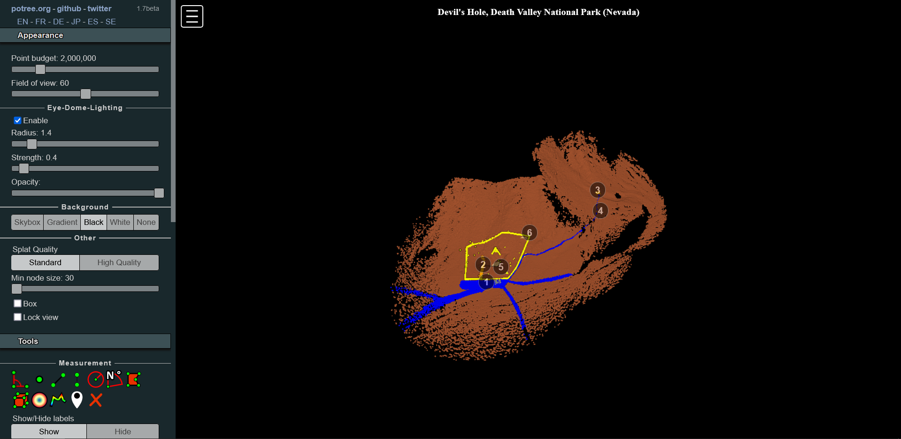

There are many ways to add annotations interactively and change the appearance of the point cloud in this html page. This is done by open the html file in a code editor, live VSCode mentioned earlier.  

The easiest parameters to change are the shape of the clouds displayed on the page (circles or squares), whether their displayed size is fixed or adaptive (adjusting when scrolling in or out), which scalar field of the point cloud is displayed on the page (classification for instance, return intensity, depth, etc...). 

Simply browse and copy existing blocks of code and adjust the coordinates of each annotation, measurement, animation and then reload the html page in your browser to check the difference this makes. 

*Contact tangracine@gmail.com for further details*

### Making it available online 
To make it available online and not just on your local machine, you should do the following: 

*Contact tangracine@gmail.com for further details*


